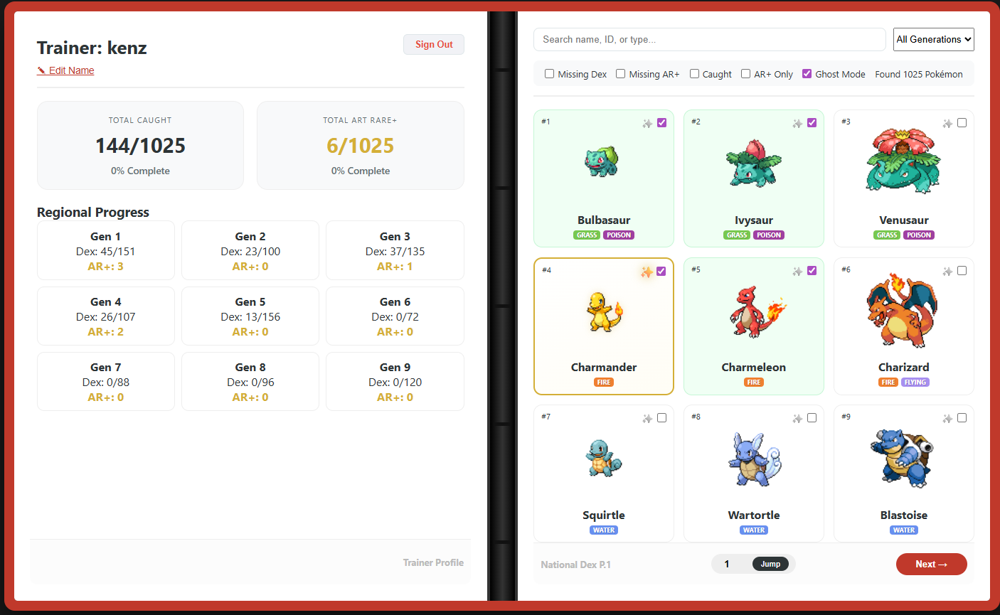

# 🎴 PokeBinder | TCG National Dex Collector


> **"Built by a collector, for collectors."**

I am currently collecting physical Pokémon TCG cards with the goal of completing a full National Dex. I couldn't find a tracker that matched my preference for a realistic 3x3 binder aesthetic—**so I built my own.**



## 🌐 Live Site
**[Open PokeBinder Here](https://knblitz.github.io/PokeBinder/)** *(Sign in with Google to sync your collection across your desktop and mobile devices.)*

---

## 📖 The Backstory
Most digital trackers are just flat lists, spreadsheets, or text-heavy databases. As a TCG collector, the joy of the hobby is in the **visual organization**. I wanted something that felt like my physical Ultra PRO binder. 

PokeBinder mimics the experience of flipping through a real 9-pocket-page collection. It allows me to visualize my progress from Bulbasaur to Pecharunt, helping me identify exactly which slots are empty in my physical storage.

---

## 🚀 Key Features

### ☁️ Cloud Sync & Security
* **Firebase Integration:** Your collection isn't stored in local browser cache; it's saved to **Google Firestore**.
* **Google OAuth:** Secure, one-tap login. No need to manage a separate username or password.
* **Cross-Platform:** Update your "Caught" list on your desktop at home, and check it on your phone while browsing at a card shop.

### 🎨 Realistic 3x3 Binder UI
* **9-Pocket Grid:** A meticulously designed CSS layout that maintains a 3x3 card spread across all screen sizes.
* **Binder Aesthetic:** Includes a central metallic spine with rings and a classic "Binder Red" theme.
* **Animated Interaction:** Hover effects on desktop allow for "inspecting" cards, while touch interactions on mobile are optimized for quick logging.

### ✨ AR+ (Art Rare) Specialized Tracking
* **Dual Tracking:** Track the standard card and the Art Rare/Special Illustration Rare version separately for every entry.
* **Glint Effect:** Custom CSS keyframe animations provide a holographic "shine" on cards marked as Art Rares.
* **Visual Hierarchy:** AR+ cards feature a gold-bordered glow and a "Star Pulse" indicator.

### 🔍 Collector-Focused Tools
* **Ghost Mode:** When enabled, missing cards appear as semi-transparent "ghost" silhouettes. This helps you visualize the full Dex without losing track of your current progress.
* **Smart Filtering:** Real-time filtering by Name, ID, or Type.
* **Gen-Specific Navigation:** Jump directly to specific eras, from Kanto (Gen 1) to Paldea (Gen 9).

---

## 🛠️ Tech Stack

* **Frontend:** Vanilla JavaScript (ES6+), HTML5, CSS3.
* **Layout Engine:** CSS Grid for the 9-pocket system and Flexbox for the UI controls.
* **Backend:** Google Firebase (Firestore NoSQL & Authentication).
* **Data Source:** Integrated with PokéAPI for up-to-date National Dex data.
* **Branding:** Custom `PokeGym` iconography.

---

## 📱 Mobile Optimization
Recognizing that many collectors use their phones while at trade events, PokeBinder uses a specialized responsive engine. Unlike standard grids that collapse into a single column, PokeBinder scales the cards down to maintain the **3x3 visual spread**, ensuring you always see your "page" exactly as it looks in a real binder.

---

## 📂 Project Structure
```text
├── index.html          # Main application structure
├── style.css           # Custom binder UI and animations
├── script.js           # Core logic and Firebase integration
├── PokeGym.png         # Custom application favicon
├── preview.png         # Repository preview image
└── README.md           # Documentation
